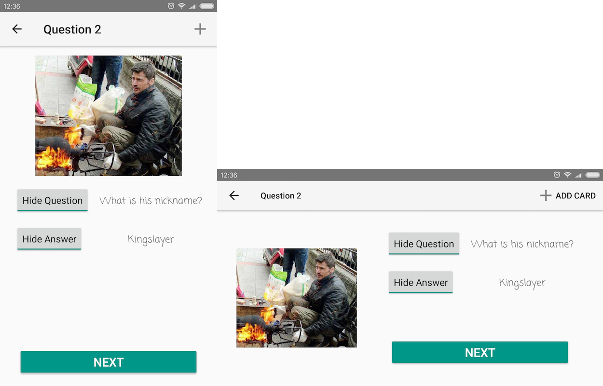

### CP470 Android Programming

Unothing => You know nothing, Jon Snow

#### Assignment1 Features

- Customized rounded icon

- ConstraintLayout

  

- MVP pattern

- Using XML file to store text data

- Funny pictures

#### Assignment2 Features

- Adaptive Layout

- Adding new card

